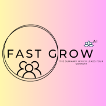

# Fast Grow Content Analyzer




## Description

Welcome to Fast Grow, your one-stop destination for cutting-edge content analysis tools. At Fast Grow, we harness the power of advanced AI technology to provide two essential services: YouTube Comment Key Point Finder and Data Summarizer.

With our YouTube Comment Key Point Finder, we offer a revolutionary solution for content creators and marketers seeking valuable insights from audience feedback. Simply input the YouTube video link or comment section, and our AI algorithm swiftly identifies and highlights key points, enabling you to grasp the essence of user opinions and sentiments with unparalleled efficiency.

In addition, our DATA Summarizer sets a new standard in data analysis. Whether you're a student, researcher, or professional, our intuitive platform allows you to upload any document and pose specific questions. Our AI engine meticulously scans the content, extracts relevant information, and generates concise summaries tailored to your inquiry. Gone are the days of laborious manual reading; with Fast Grow, access to comprehensive data summaries is just a click away.

Join the Fast Grow community today and revolutionize the way you analyze content. Experience the power of AI-driven insights and propel your growth journey with confidence.


## Technologies Used:
   > Flask Framework: Fast Grow is built using Flask, a lightweight and efficient web framework for Python, enabling rapid development of web applications.
  
   > Python: The project is primarily developed in Python, a versatile and powerful programming language well-suited for natural language processing (NLP) tasks.
  
   > Natural Language Processing (NLP): Leveraging NLP techniques and methodologies, Fast Grow extracts valuable insights from textual data, enabling users to understand and analyze content more 
    effectively.
 
   > Libraries: Fast Grow utilizes various Python libraries for different functionalities, including:
     > NumPy: For efficient numerical operations and data manipulation.
     > Pandas: For data analysis and manipulation, particularly useful for handling tabular data.
     > NLTK (Natural Language Toolkit): A comprehensive library for NLP tasks such as tokenization, stemming, and sentiment analysis.
     > YouTube Data API: Fast Grow integrates with the YouTube Data API to fetch comments from YouTube videos, providing valuable user feedback for analysis.
     > Hugging Face API: For text summarization, Fast Grow utilizes the Hugging Face API, which offers state-of-the-art natural language processing models and tools.

Sentiment Analysis: Fast Grow employs sentiment analysis techniques to determine the polarity of sentences, categorizing them as negative, positive, or neutral. This helps users gauge the overall sentiment conveyed in the text.

## To Run the App

1. Clone the repository:
 ```
    git clone https://github.com/Rudraksh2003/Fast-Grow.git
 ```
2. Navigate to the project directory:

```
  cd Fast-Grow-Content-Analyzer
 ```
3. Add Youtube API key in Secrets.toml
4. Add API key in data.py
5. Open two separate terminals:

- **Terminal 1:**
  ```
     python app1.py
  ```

- **Terminal 2:**
  ```
    python app2.py
  ```


